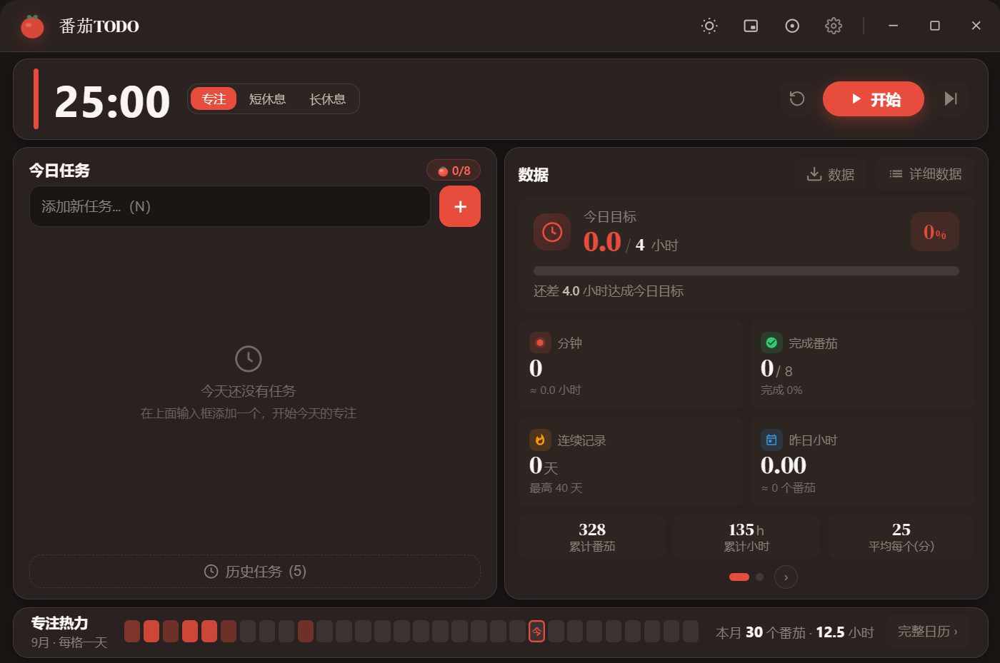
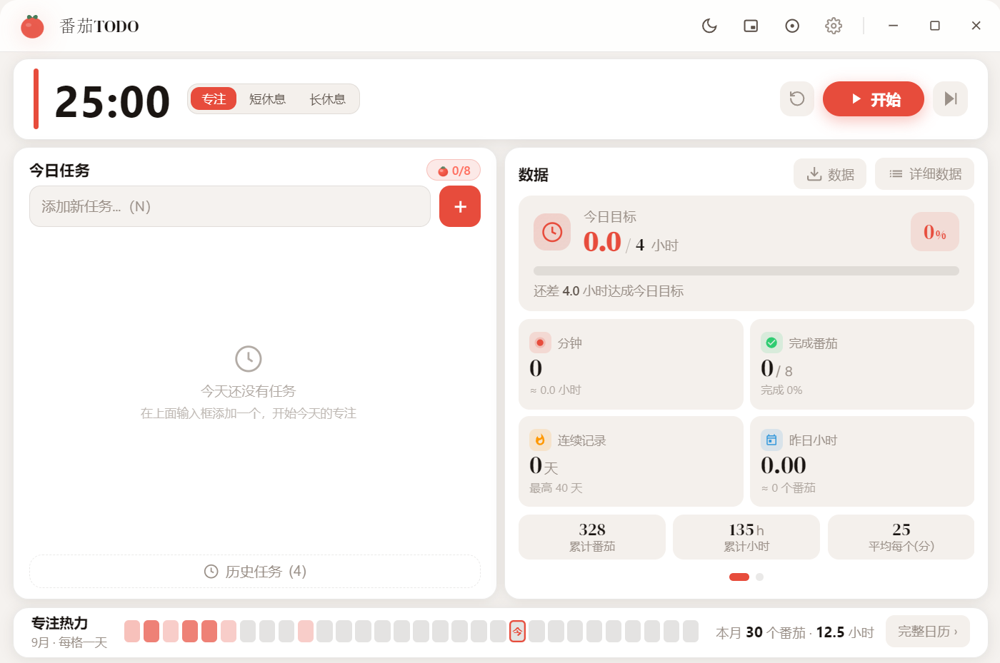
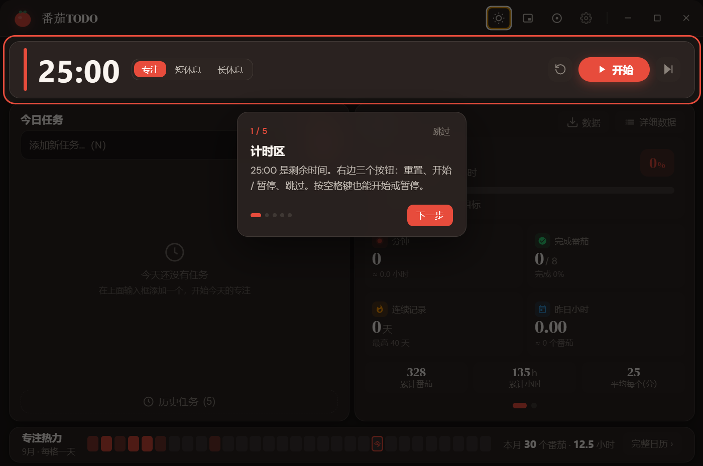

# 番茄TODO

基于 **Electron + Vue 3** 的番茄工作法桌面应用。三段式仪表盘、深色/浅色主题、专注小窗与沉浸模式、热力图统计、数据导入导出。



## 功能特性

### ⏱️ 计时
- **三种模式** —— 专注 / 短休息 / 长休息，每 4 个番茄自动触发长休息
- **沉浸模式** —— 全屏专注视图，按 `Esc` 退出（计时不中断）
- **专注小窗** —— 独立置顶小窗，可锁定位置；锁定后隐藏关闭按钮，避免误触
- **误触保护** —— 计时进行中切换模式会先弹确认（并显示已进行时长），不会误清空当前番茄

### 📋 任务
- 添加任务、把某个任务设为「当前专注」，番茄结束后自动记在它头上
- 一个番茄只记在一个任务上（避免统计口径混乱）
- 已完成 / 已归档任务单独收拢，不干扰今日列表

### 📊 数据
- **两页数据卡** —— 概览（今日目标进度 + 四项统计 + 累计数据）/ 趋势（本周柱状图）
- **热力图** —— 底部热力条 + 完整日历弹窗，点标题或格子查看某一天的记录
- **连胜与累计** —— 连续打卡天数、终身累计专注时长
- **今日目标** —— 横条进度，超额完成显示实际百分比（如 200%）

### ✨ 体验
- **新手引导** —— 首次启动自动弹出 5 步聚光灯引导，设置面板底部可随时「重看引导」
- **音效提醒** —— 四种内置音效（Web Audio 合成，无需音频文件）+ 支持自定义音频
- **主题切换** —— 深色 / 浅色
- **系统托盘** —— 托盘菜单直接显示剩余时间，并可一键开始 / 继续 / 暂停
- **快捷键** —— 常用操作全键盘可达，切窗口快捷键可在设置里自定义
- **数据备份** —— JSON / CSV 导出，导入后 100% 还原（含统计与连胜）

## 下载

到 [Releases](https://github.com/loong-git/TOMATO_TODO/releases) 页面下载最新版本：

| 文件 | 说明 |
|------|------|
| `番茄TODO时钟-x.y.z-x64.exe` | **NSIS 安装包** —— 可选安装目录，推荐 |
| `番茄TODO时钟-x.y.z-portable.exe` | **免安装版** —— 单文件，双击即用 |
| `番茄TODO时钟-x.y.z-x64.zip` | **解压即用** —— 解压后运行目录内的 exe |

## 截图

| 深色主题 | 浅色主题 |
|:---:|:---:|
|  |  |



> 新手引导：首次启动自动弹出 5 步聚光灯引导，逐区介绍计时、模式切换、任务、数据与热力图；
> 设置面板底部可随时「重看引导」。

## 技术栈

| 技术 | 版本 |
|------|------|
| Electron | ^28.2.5 |
| Vue 3 | ^3.4.21 |
| TypeScript | ^5.4.2 |
| Vite | ^5.1.6 |
| Pinia | ^2.1.7 |
| electron-store | ^8.1.0 |

## 快速开始

```bash
# 1. 安装依赖（postinstall 会自动给 electron-builder 打无证书补丁）
npm install

# 2. 生成应用图标（产出 build/icon.ico，打包时 electron-builder 需要它）
npm run icon

# 3. 开发模式（同时起 Vite 与 Electron）
npm run dev
```

### 打包

```bash
npm run build:zip        # zip（解压即用）
npm run build:portable   # 单 exe 免安装版
npm run build:all        # zip + portable + NSIS 安装包
```

产物输出到 `release/`，文件名格式为 `番茄TODO时钟-<version>-<arch>.<ext>`，
**发版前记得先改 `package.json` 的 `version`**。

> 应用图标由 `icon.svg` 生成：`icon.svg`（源，入库）→ `npm run icon` → `build/icon.ico`（生成物，不入库）。

## 快捷键

| 按键 | 功能 |
|------|------|
| `Space` | 开始 / 暂停计时器 |
| `R` | 重置计时器 |
| `S` | 打开设置 |
| `N` | 聚焦任务输入框 |
| `1` / `2` / `3` | 切到专注 / 短休息 / 长休息 |
| `Escape` | 关闭弹窗 / 退出沉浸模式 |
| `Alt+F` | 切沉浸模式（可在设置自定义） |
| `Alt+M` | 切小窗专注（可在设置自定义） |

> ⚠️ 计时进行中按 `1`/`2`/`3` 切换模式同样会先弹确认，不会直接清空当前番茄。

## 项目结构

```
TOMATO_TODO/
├── electron/                 # Electron 主进程
│   ├── main.ts               # 主进程入口（窗口/托盘/快捷键/IPC）
│   ├── preload.ts            # 预加载脚本（contextBridge 暴露 electronAPI）
│   └── logger.ts             # 文件日志
├── src/                      # Vue 渲染进程
│   ├── components/
│   │   ├── TimerDisplay.vue      # 倒计时数字
│   │   ├── TimerControls.vue     # 重置 / 开始暂停 / 跳过
│   │   ├── ModeSelector.vue      # 模式切换（含误触确认）
│   │   ├── TaskList.vue          # 今日任务 + 历史任务
│   │   ├── StatsDisplay.vue      # 数据卡（两页）+ 热力图
│   │   ├── SettingsPanel.vue     # 设置面板
│   │   ├── DataManager.vue       # 数据导入导出
│   │   ├── FocusWindow.vue       # 专注小窗（独立进程）
│   │   ├── OnboardingTour.vue    # 新手引导（聚光灯分步）
│   │   ├── CelebrationOverlay.vue # 番茄完成动画
│   │   └── AppToast.vue          # 全局 toast
│   ├── stores/                   # Pinia
│   │   ├── timer.ts              # 计时器（含 primaryLabel 等派生状态）
│   │   ├── task.ts               # 任务
│   │   ├── stats.ts              # 记录与统计
│   │   └── settings.ts           # 设置
│   ├── types/
│   │   ├── index.ts              # 业务类型（Task / Settings / ...）
│   │   └── electron.d.ts         # window.electronAPI 的类型声明
│   ├── utils/
│   │   ├── index.ts              # 音效、格式化、快捷键匹配
│   │   ├── onboarding-state.ts   # 新手引导开关（模块级 ref）
│   │   ├── shortcut-state.ts     # 快捷键录制状态
│   │   └── toast.ts              # toast 单例
│   ├── styles/global.css
│   ├── App.vue                   # 根组件（三段式布局 + 全局快捷键）
│   └── main.ts                   # 应用入口
├── build/                    # 构建脚本（electron-builder buildResources）
│   ├── patch-app-builder.js  # postinstall：绕过无证书签名 bug
│   ├── clean-release.js      # 打包后清理 release/ 中间产物
│   └── after-pack.js         # afterPack：用 rcedit 烧入图标
├── icon.svg                  # 图标源文件
├── generate-icon.js          # 图标生成脚本
├── index.html
├── vite.config.ts
└── package.json
```

## 数据结构

### Task（任务）
```typescript
interface Task {
  id: string                  // 唯一标识
  name: string                // 任务名称
  completedPomodoros: number  // 完成的番茄数
  isCompleted: boolean        // 是否完成
  createdAt: number           // 创建时间戳
  completedAt: number | null  // 完成时间
  archivedAt: number | null   // 归档时间
}
```

### PomodoroRecord（番茄记录）
```typescript
interface PomodoroRecord {
  id: string
  taskId: string                                  // 关联任务 ID
  type: 'focus' | 'shortBreak' | 'longBreak'      // 番茄类型
  duration: number                                // 时长（秒）
  completedAt: number                             // 完成时间戳
}
```

### Settings（设置）
```typescript
interface Settings {
  focusDuration: number         // 专注时长（分钟）
  shortBreakDuration: number    // 短休息时长
  longBreakDuration: number     // 长休息时长
  longBreakInterval: number     // 长休息间隔（几个番茄后）
  dailyGoal: number             // 每日目标（番茄数）
  dailyHourGoal: number         // 每日目标（小时）
  soundEnabled: boolean         // 声音提醒
  notificationEnabled: boolean  // 系统通知
  soundType: SoundType          // 音效类型
  soundPath: string             // 自定义音频路径
  theme: 'dark' | 'light'       // 主题
  closeBehavior: 'tray' | 'quit' // 关闭窗口时的行为
  shortcuts: ShortcutConfig     // 自定义快捷键
  hasSeenOnboarding: boolean    // 是否看过新手引导
}
```

## 状态管理（Pinia Stores）

### timerStore
```typescript
// 状态
timeLeft: number           // 剩余秒数
isRunning: boolean         // 是否运行中
mode: TimerMode            // 当前模式
pomodoroCount: number      // 本组番茄计数
currentTaskIds: string[]   // 当前选中的任务
focusModeActive: boolean   // 是否处于专注窗口模式
streakCount: number        // 连续打卡天数

// 派生
formattedTime: string      // "25:00"
currentDuration: number    // 本模式总时长（秒）
primaryLabel: string       // 主按钮文案：开始 / 继续 / 暂停

// 方法
start() / pause() / reset() / complete() / skip()
setMode(mode: TimerMode)
toggleCurrentTask(taskId: string)
```

> `primaryLabel` 的判据：运行中 → `暂停`；`timeLeft === currentDuration`（这一轮还没跑过）→ `开始`；其余 → `继续`。
> 沉浸模式 / 计时卡 / 专注小窗三处共用同一套判据。

### taskStore / statsStore / settingsStore

```typescript
// taskStore
tasks / activeTasks / historyTasks / archivedTasks
addTask(name) / updateTask(id, updates) / deleteTask(id)
completeTask(id) / archiveTask(id) / unarchiveTask(id)
exportAllData() / exportAsCSV() / importAllData(json)

// statsStore
records / todayCount / weekCount
addRecord(record) / loadRecords() / saveRecords()

// settingsStore
settings
updateSettings(updates) / resetSettings() / loadSettings() / saveSettings()
```

## IPC 通信 API

渲染进程通过 `window.electronAPI` 访问主进程能力（`electron/preload.ts` 用 `contextBridge` 暴露）：

```typescript
// 数据存储（electron-store）
store.get(key) / store.set(key, value) / store.delete(key)

// 文件对话框
dialog.openFile() / saveFile(data, name) / saveCSV(data, name) / openJsonFile()

// 系统通知 / 音频
notification.show({ title, body })
audio.play(filePath) / audio.stop() / audio.onEnd(cb)

// 窗口控制
window.minimize() / close() / bringToFront() / toggleMaximize() / onMaxState(cb)

// 专注小窗（独立 BrowserWindow）
focus.open(data, mode) / close() / getInitData()
focus.sendState(data) / onStateUpdate(cb) / onFocusModeChange(cb)
focus.control(action) / onControl(cb) / toggleLock(locked)

// 托盘
tray.updateState(data) / onToggleTimer(cb)

// 电源事件
power.onSystemResume(cb)
```

> ⚠️ **所有 `on*` 监听都走 `preload.ts` 的 `onSingle()`**（注册前先 `removeAllListeners`）。
> `ipcRenderer.on` 只加不减，Vite HMR 每次热更新组件都会重复注册，会导致一次点击触发 N 次回调。

## 番茄钟流程

```
专注(25min) → 短休息(5min) → 专注 → 短休息 → 专注 → 短休息 → 专注 → 长休息(15min)
                                 每 4 个番茄后触发长休息
```

时长与间隔均可在设置中调整。

## 音效系统

| 类型 | 描述 | 场景 |
|------|------|------|
| `bell` | 铃铛连环撞击声 | 专注结束 |
| `forest` | 鸟鸣啾啾声 | 休息开始 |
| `ding` | 叮咚上行旋律 | 提示音 |
| `tick` | 时钟滴答声 | 倒计时 |

使用 Web Audio API 合成，无需外部音频文件；也支持选择本地音频文件。

## 主题系统

通过 CSS 变量 + `data-theme` 属性切换：

```css
[data-theme="dark"] {
  --bg-primary: #1a1614;
  --text-primary: #faf5f0;
  --tomato: #e74c3c;
}

[data-theme="light"] {
  --bg-primary: #f5f2ef;
  --text-primary: #1a1512;
  --tomato: #e74c3c;
}
```

> ⚠️ 新增卡片内的"次级表面"时用 `--bg-secondary`，它必须在卡片底色 `--bg-card` 之上可见 ——
> 浅色主题下这两个值很接近，直接复用会导致分区看不见。

## 数据持久化

使用 `electron-store` 存储，dev 与打包版的数据目录不同：

| key | 内容 |
|-----|------|
| `tasks` | 任务列表 |
| `records` | 番茄记录（保留 365 天） |
| `settings` | 用户设置 |
| `streakData` | 连胜数据 |
| `lifetimeStats` | 永久累计统计 |
| `yearStats` | 按年统计 |

> 数据目录不提交到 git，属用户本地数据。建议定期用设置面板里的导出功能备份。

## 开源协议

本项目基于 **MIT License** 开源，详见 [LICENSE](./LICENSE)。

MIT 允许自由使用、修改、分发（含商用），但必须保留版权声明，且作者不承担任何责任。
